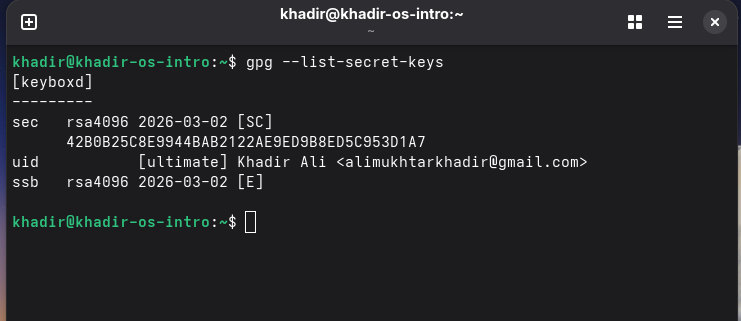
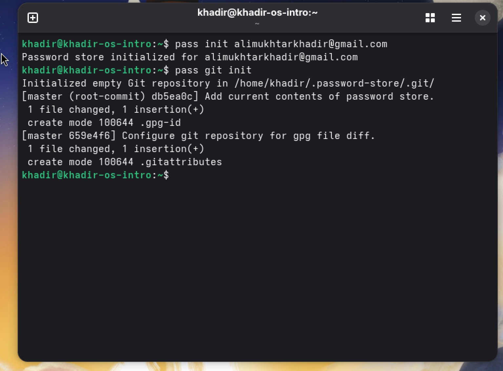
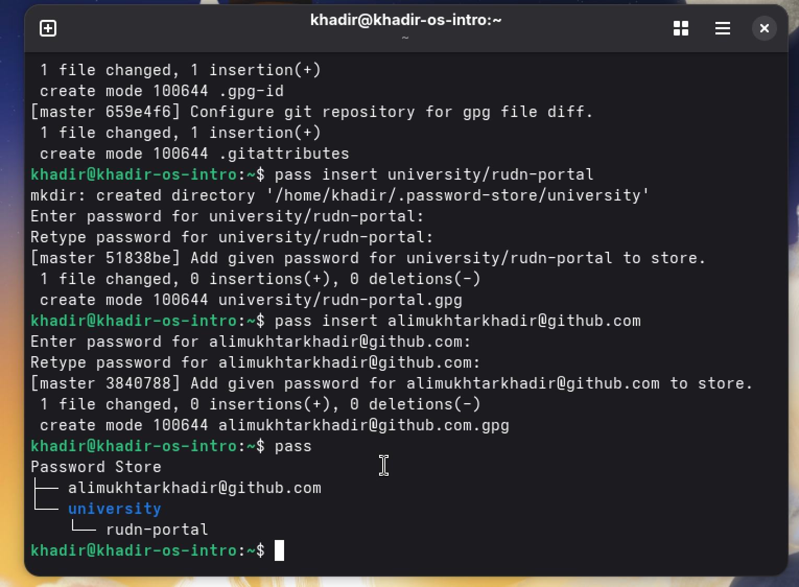
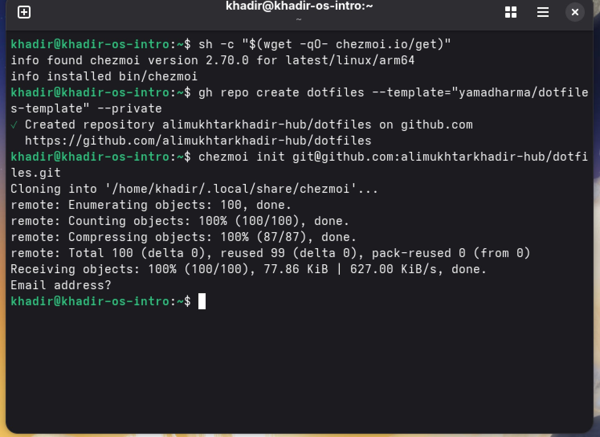
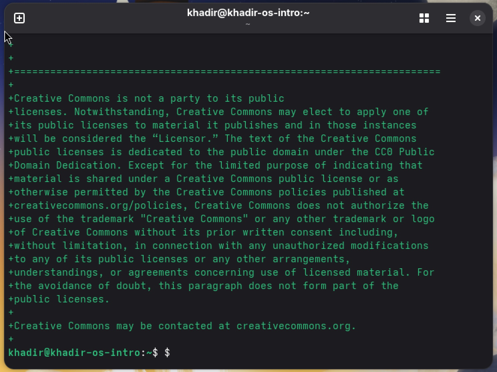

# Лабораторная работа №5: Менеджер паролей и управление конфигурацией

**Автор:** Хадир Али  
**Группа:** НПИбд-01-25  

## Цель работы

Освоить работу с менеджером паролей `pass` и утилитой для управления конфигурационными файлами `chezmoi`.

## Выполнение работы

### 1. Настройка GPG ключа

Для шифрования данных использовался существующий GPG ключ:

- **ID ключа:** 42B0B25C8E9944BAB2122AE9ED9B8ED5C953D1A7
- **UID:** Khadir Ali <alimukhtarkhadir@gmail.com>

### 2. Менеджер паролей (pass)

Инициализировано хранилище паролей и создана семантическая структура каталогов:

- Выполнена инициализация: `pass init alimukhtarkhadir@gmail.com`
- Созданы записи в категориях `university/` и `github/`

### 3. Инициализация chezmoi

Репозиторий dotfiles подключён к системе через chezmoi:

### 4. Управление конфигурацией (chezmoi diff)

Утилита chezmoi отслеживает изменения в домашнем каталоге:

### 5. Репозитории на GitHub

Оба репозитория созданы и установлены как приватные:

- Репозиторий конфигов: https://github.com/alimukhtarkhadir-hub/dotfiles
- Репозиторий паролей: https://github.com/alimukhtarkhadir-hub/password-store

## Вывод

В ходе работы были успешно внедрены инструменты для безопасного хранения паролей и автоматизированного управления конфигурациями рабочей среды с использованием GPG, pass и chezmoi. Все изменения зафиксированы и синхронизированы с удалёнными репозиториями на GitHub.
