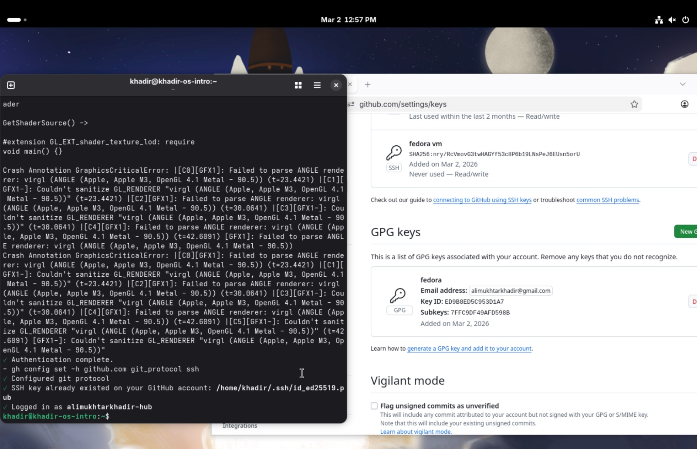
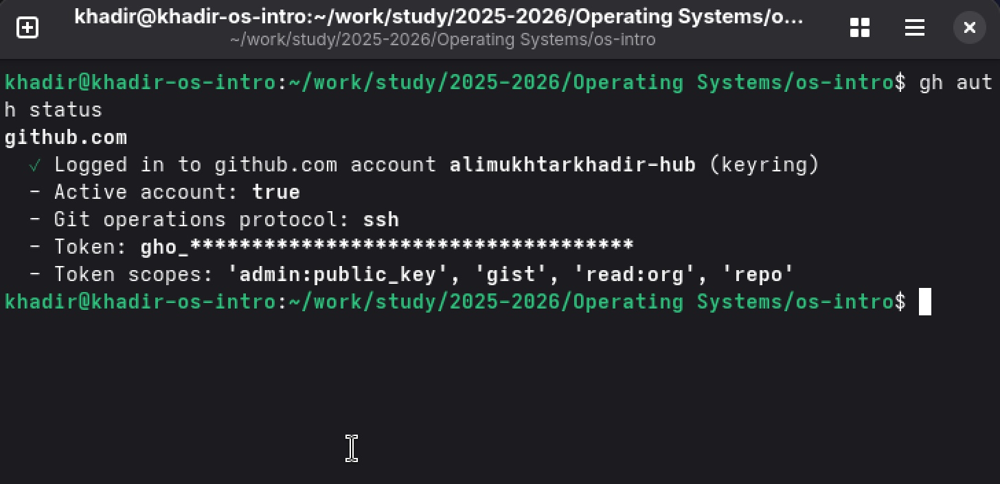
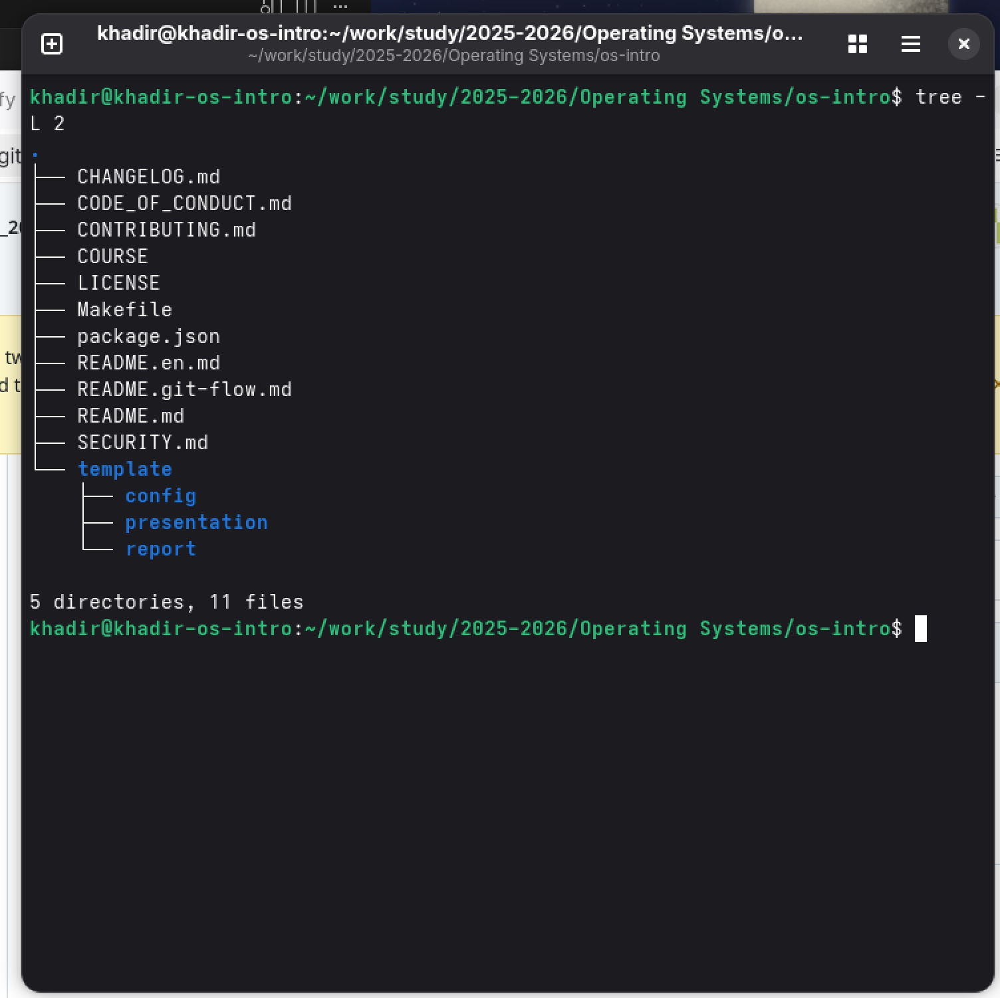
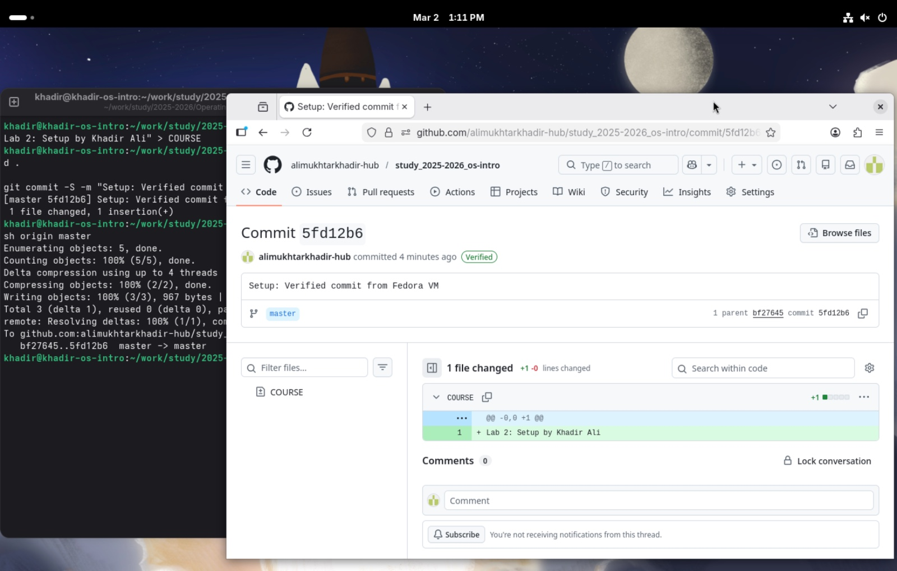

---
# Front matter
title: "Лабораторная работа № 2"
subtitle: "Системы управления версиями"
author: "Хадир Али"

# Generic options
lang: ru-RU
toc-title: "Содержание"

# Pdf output format
toc: true
toc-depth: 2
lof: true
lot: true
fontsize: 12pt
linestretch: 1.5
papersize: a4
documentclass: scrreprt

# Fonts - ADDED THESE TO FIX "MISSING CHARACTER" ERRORS
mainfont: "DejaVu Serif"
sansfont: "DejaVu Sans"
monofont: "DejaVu Sans Mono"

# Polyglossia/Babel
polyglossia-lang:
  name: russian
polyglossia-otherlangs:
  name: english
babel-lang: russian
babel-otherlangs: english

# Header customization
indent: true
header-includes:
  - \usepackage{indentfirst}
  - \usepackage{float}
  - \floatplacement{figure}{H}
---

# Цель работы

Целью данной лабораторной работы является освоение основных принципов работы с системой управления версиями Git. Это включает настройку идентификации пользователя, настройку SSH для безопасного доступа и внедрение GPG-подписей для верификации коммитов.

# Задание

1. Установить и настроить Git и GitHub CLI в Fedora.
2. Создать и связать SSH-ключ с GitHub.
3. Создать и связать GPG-ключ для подписанных коммитов.
4. Создать каталог курса на основе шаблона преподавателя.
5. Выполнить верифицированный коммит и отправить его в репозиторий.

# Выполнение лабораторной работы

## Начальная настройка
Я установил необходимые инструменты и настроил глобальную идентификацию. На скриншоте (рис. [-@fig:01]) показана настройка имени пользователя и адреса электронной почты.

{#fig:01 width=70%}

## Настройка SSH и GPG
Я сгенерировал SSH-ключ Ed25519 для доступа к GitHub. Также я сгенерировал GPG-ключ RSA 4096 бит для подписи коммитов. Настройка ключей в профиле GitHub представлена на рис. [-@fig:02].

{#fig:02 width=70%}

## Авторизация GitHub CLI
Я выполнил авторизацию в GitHub через терминал с помощью утилиты `gh` (рис. [-@fig:03]).

{#fig:03 width=70%}

## Работа с репозиторием
Используя GitHub CLI, я создал репозиторий `study_2025-2026_os-intro` из шаблона. Я проверил структуру каталогов репозитория (рис. [-@fig:04]).

{#fig:04 width=70%}

Я выполнил подписанный коммит, который теперь отображается на GitHub с зеленой меткой "Verified" (рис. [-@fig:05]).

{#fig:05 width=70%}

# Контрольные вопросы

1. **Что такое VCS?** Система управления версиями — это ПО для фиксации изменений в файлах с возможностью отката к старым версиям.
2. **Что такое коммит?** Снимок состояния репозитория в истории.
3. **Что такое репозиторий?** Место хранения файлов и всей истории проекта.
4. **Централизованные vs Распределенные VCS?** В централизованных (SVN) один сервер, в распределенных (Git) копия истории есть у каждого.
5. **Роль ветки?** Позволяет работать над фичами, не ломая основной код.
6. **Как объединять ветки?** С помощью команды `git merge`.
7. **Что такое конфликт?** Ситуация, когда Git не может сам решить, какие изменения в строке важнее.
8. **Что такое .gitignore?** Список файлов, которые Git должен игнорировать.
9. **Роль удаленного репозитория?** Сервер (GitHub) для совместной работы.
10. **Как получить изменения?** Командой `git pull`.

# Выводы

В ходе выполнения лабораторной работы я настроил среду Fedora для безопасного взаимодействия с GitHub. Я успешно внедрил GPG-подписи, которые необходимы для поддержания целостности кода в профессиональной среде разработки.