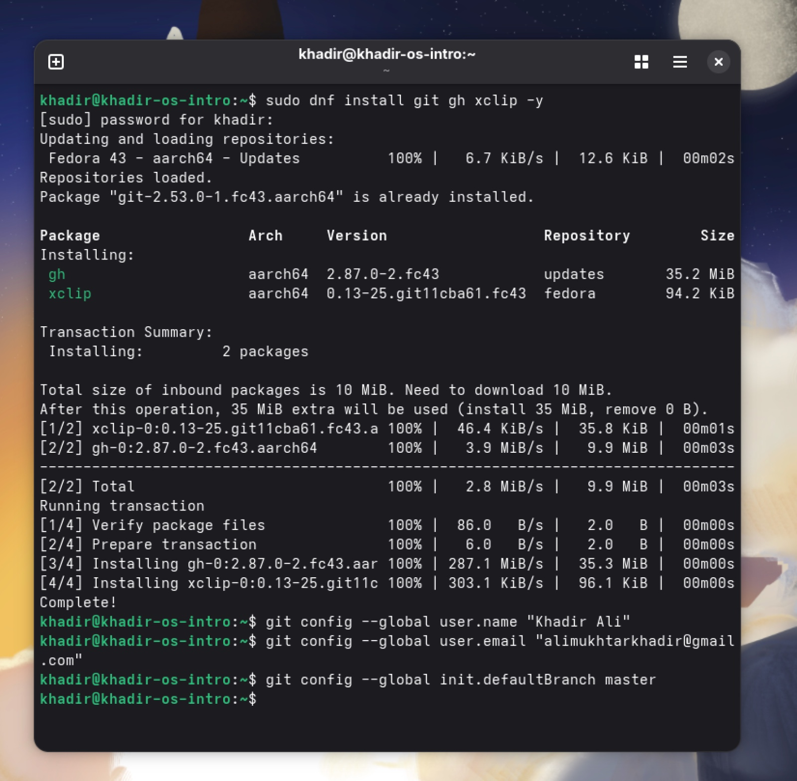

---
# Front matter
title: "Лабораторная работа № 3"
subtitle: "Markdown"
author: "Хадир Али"

# Generic options
lang: ru-RU
mainfont: "DejaVu Serif"
sansfont: "DejaVu Sans"
monofont: "DejaVu Sans Mono"

# Polyglossia/Babel
polyglossia-lang:
  name: russian
polyglossia-otherlangs:
  name: english

# Header customization
indent: true
header-includes:
  - \usepackage{indentfirst}
  - \usepackage{float}
  - \floatplacement{figure}{H}
---

# Цель работы
Научиться оформлять отчёты с помощью легковесного языка разметки Markdown.

# Выполнение работы

## Примеры разметки
В этой работе я использую различные элементы Markdown. Например, цитату:

> Markdown — это простой язык разметки, который легко конвертировать в PDF или HTML.

## Математические формулы
Согласно заданию, я вставляю пример математической формулы:
$$\sin^2(x) + \cos^2(x) = 1$$

## Изображения из лабораторной работы №2
На рис. [-@fig:01] показана настройка Git.

{#fig:01 width=70%}

# Выводы
Я освоил синтаксис Markdown и научился автоматизировать создание отчетов в форматах PDF и DOCX с помощью Makefile.
